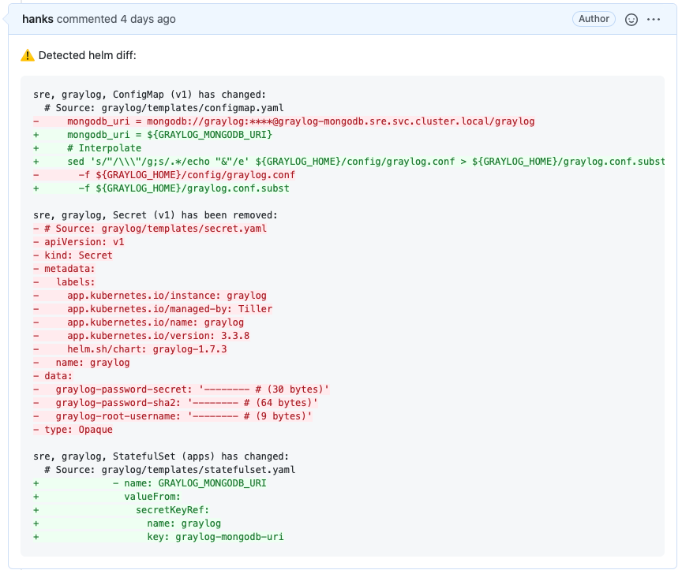

[](https://coveralls.io/github/hanks/helm-diff-notifier?branch=main) [](https://goreportcard.com/report/github.com/hanks/helm-diff-notifier) [](https://circleci.com/gh/hanks/helm-diff-notifier)

# Introduction

Helm Diff Notifier is a simple tool based on [helm-diff](https://github.com/databus23/helm-diff), mainly using in the CI pipeline, to send the helm diff result to GitHub PR review page.



## Features

* Could simplify diff result by picking up the key diff lines
  * Eventually found there is already a feature in helm-diff, that could simplify the final result by providing option `-C int`
* Desensitization by using provided rules

## Usage

Right now it is only supported in CircleCI pipeline, you could config the tool like below:

1. Setup Github Token as `GITHUB_API_TOKEN` in the CircleCI context
1. Config CircleCI jobs in `config.yml` to use this tool with helm diff result

   ```sh
   helm diff upgrade -n namespace foo-release | helm-diff-notifier
   ```

## Development

Prerequisites:

* Docker

This project is fully dockerized. So you could setup your local env by only install Docker.

Basic commands used in local dev:

* enable debug mode, `export HELM_DIFF_DEBUG=true`
* run test, `make test`
* build local dev image, `make build-dev-image`

More commands you could check the details in `Makefile`
